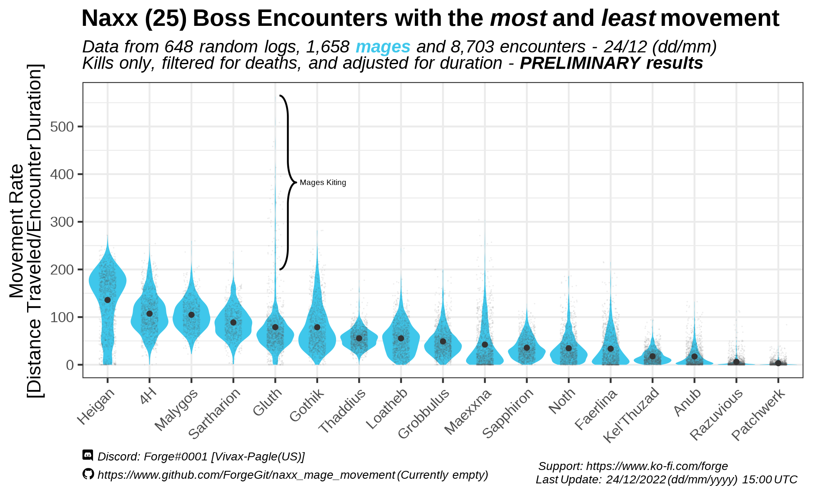
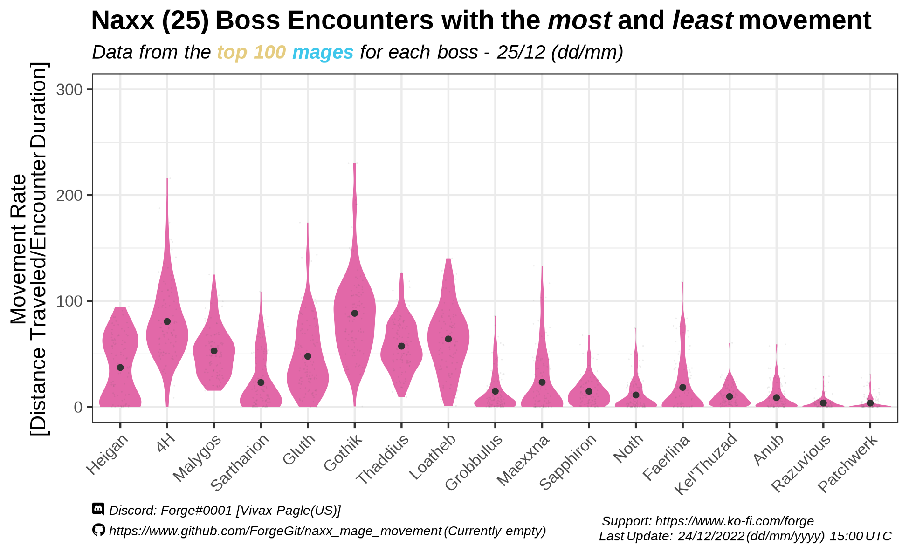
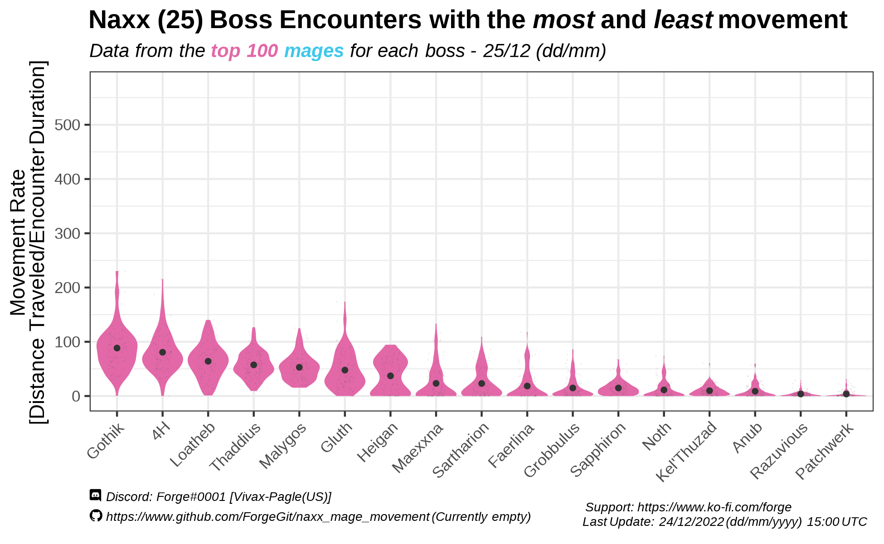
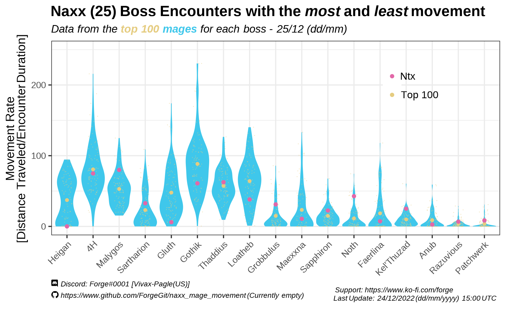

# Mage movement by boss - Naxx 25 man Wrath of the Lich King

This is a somewhat extensive analysis I did on mage movement for Naxx 25 bosses some time ago, in late P1 WOTLK Classic (Dec-2023).
Unlike other mini projects I have, where I try my best to document and explain the analysis process, I won't go into too many details here, mostly because of time (but I plan on coming back and try to update it with Ulduar data).

Feel free to ask me for any specifics or the raw/processed data to recreate the following graphics (or verify them).

# Table of Contents
1. [Definition of movement](#movement)  
2. [Avg. Movement per boss](#average-movement-per-boss)  
3. [Movement on top 100 parses](#movement-top-100-parses) 
4. [Practical use](#ok-and) 

## "Movement"

The metric of "movement", for all purposes of this document, correspond to mages and is being measured as the total distance you moved during the encounter, measured on every action you do. 

idk on what units this distance is measured (or at least can't explain it properly, yet) and these measurements aren't "adjusted for" blink usage, whether you were casting while moving or not,  or if you had a good parse/speed or encounter duration.

In other words, if you moved, I will measure the distance you took from X to Y, and add it to the "total distance" you moved during the fight.

I am excluding all mages that had deaths on the encounter, and this considers only kills. Otherwise, death mages would have a "lower movement" and this would be a significant bias in the data. 

## Average movement per boss

Each encounter (boss) is ordered from those who had, on average, higher movement vs those who do not.

It is interesting to see that what we know as a "patchwerk fight" (basically, sim conditions of a standstill tank and spank fight) can be perfectly seen and measured with irl data.

## Movement top 100 parses

The following plot measures the same "movement" metric, this time with the 100 top parses per boss at the time

Using the same y-axis scale as the first graphic, and ordering each boss, we get the following

Comparing both we can see top parses, on average, had considerably less "movement" during the encounter.

## Ok, and?

This in practice allows you to measure your movement vs the movement of the "average" mage or the "average top 100" mage. Or simply, quantify how much movement there is on each boss (which is important to know in order to minimize downtime as a caster)

Here we have a log of "Ntx", who had a really high parse on his encounters

Here we have a log of "Epiloof", who had a speedrun. He parsed high for each encounter, however, he had to move a lot more because the aim of the run was the speed metric.

# Other analysis done

- Check other things I have done here: https://github.com/ForgeGit?tab=repositories

